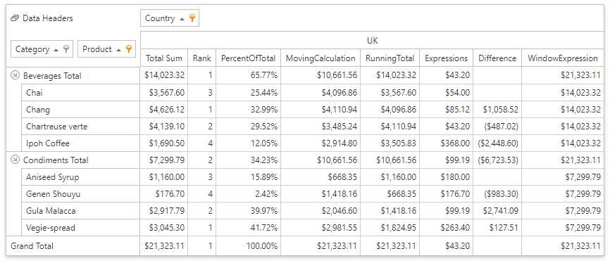

<!-- default badges list -->

<!-- default badges end -->

# ASP.NET Web Forms Pivot Grid - How to Use Data Binding API to Bind the Pivot Grid Field to Data

The example illustrates how to use Data Binding API to bind the Pivot Grid field to data. A [window](https://docs.devexpress.com/CoreLibraries/401365) in this example is the combination of the _Category/Product_ and _Country_ dimensions.

## Files to Look at

[Default.aspx](CS/AspNetWebFormsPivotFieldCalculationBindings/Default.aspx)

## Related API

* [DataSourceColumnBinding](https://docs.devexpress.com/AspNet/DevExpress.Web.ASPxPivotGrid.DataSourceColumnBinding)

    Defines a data binding to a source data column.

* [DifferenceBinding](https://docs.devexpress.com/AspNet/DevExpress.Web.ASPxPivotGrid.DifferenceBinding)

    Calculates the difference between values in the window.

* [PercentOfTotalBinding](https://docs.devexpress.com/AspNet/DevExpress.Web.ASPxPivotGrid.PercentOfTotalBinding)

    Calculates a percentage of all values in the window.

* [RankBinding](https://docs.devexpress.com/AspNet/DevExpress.Web.ASPxPivotGrid.RankBinding)

    Displays a rank according to each value in the window.

* [RunningTotalBinding](https://docs.devexpress.com/AspNet/DevExpress.Web.ASPxPivotGrid.RunningTotalBinding)

     Aggregates values cumulatively in the window.

* [WindowExpressionBinding](https://docs.devexpress.com/AspNet/DevExpress.Web.ASPxPivotGrid.WindowExpressionBinding)

    Uses a custom string expression with window functions for calculation. The expression _Total(Sum([Extended Price]))_ displays sub-totals for outer row fields (the equivalent for _Total_ and _Grand total_ values).

* [ExpressionDataBinding](https://docs.devexpress.com/AspNet/DevExpress.Web.ASPxPivotGrid.ExpressionDataBinding)

    Defines a calculation based on a string expression. The Expression _Min([Extended Price])_ displays a minimum value from the underlying data grouped by the specified window.

* [MovingCalculationBinding](https://docs.devexpress.com/AspNet/DevExpress.Web.ASPxPivotGrid.MovingCalculationBinding)
 
    Calculates aggregations across a specified number of values before and/or after the current value.

## Documentation

- [Data Binding API](http://docs.devexpress.com/CoreLibraries/401533/devexpress-pivot-grid-core-library/data-binding-api)
- [Window Calculation Functions](https://docs.devexpress.com/CoreLibraries/401375/devexpress-pivot-grid-core-library/window-calculations/window-functions)
- [Pivot Grid Expression Syntax](http://docs.devexpress.com/CoreLibraries/120512/devexpress-pivot-grid-core-library/pivot-grid-expression-syntax)

 
<!-- feedback -->
## Does this example address your development requirements/objectives?

 

(you will be redirected to DevExpress.com to submit your response)
<!-- feedback end -->
